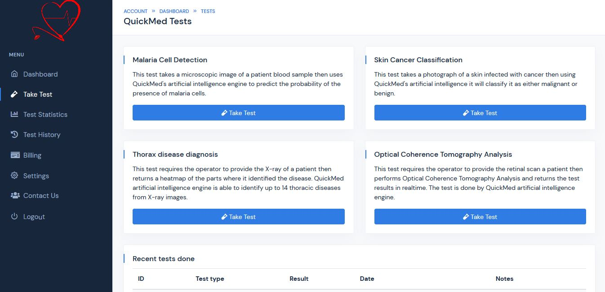

# QuickMed

Online platform that uses artificial intelligence to automate hospital diagnostics

## Current Progress
* Built landing page
* Built dashboard template
* Project logo
* Backend - Frontend Django integration
* Database setting up
* AI models setups and serving

## TO-DO
* Domain registration & hosting

## Setting Up
```bash
pip install --upgrade -r requirements.txt
```


## Authors
* [LordGhostX](https://github.com/LordGhostX)
* [Ochuko](https://github.com/Chukslord1)
* [Destiny](https://github.com/Destiny251)
